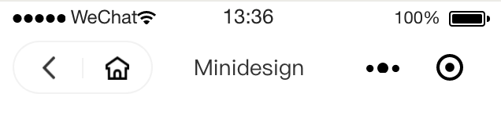
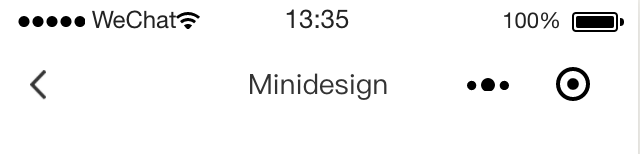

## @minidesign/header

微信小程序自定义`header`。


* 
* 


### Install

> - 从小程序基础库版本 2.2.1 或以上、及开发者工具 1.02.1808300 或以上开始，小程序支持使用 [npm](https://developers.weixin.qq.com/miniprogram/dev/devtools/npm.html) 安装第三方包
> - 如果你的不支持，那么可以先下载下来，在手动拷贝到你的`components/header`文件夹下，在使用的细节上调整一下就行了。

1. `npm install --save @minidesign/header`
2. 【微信开发者工具】->【工具】-> 【构建 npm】
3. ok. （别忘记执行【构建 npm】步骤）

### Usage

#### [page].json

```json
{
  "usingComponents": {
    "header": "@minidesign/header"
  }
}
```

#### [page].wxml

```html
<header>Minidesign Header</header>
```

### 属性参数

| Name            | Type                 | Default             | Description                                                                                                            |
| --------------- | -------------------- | ------------------- | ---------------------------------------------------------------------------------------------------------------------- |
| mode            | string               | 'classic'           | 模式，可选值： `'fashion' | 'classic' | 'cover-fashion' | 'cover-classic' | 'custom' | 'cover-custom'`                 |
| title           | string / void        | ''                  | 标题，会被默认`slot`覆盖                                                                                               |
| backgroundcolor | string / void        | '#ffffff'           | 背景颜色，正确的颜色值都可                                                                                            |
| animation       | AnimationData / void | {}                  | 动画 Data                                                                                                              |
| height          | number / void        | 自适应              | 头部高度，默认自适应，推荐默认                                                                                         |
| home            | string / void        | 'pages/index/index' | 首页按钮的路由，仅在 `mode="fashion"`时有效，默认自动识别小程序配置文件的首页，当 API 无效时获取该值                   |
| container-class | string / void        | ''                  | 容器样式                                                                                                               |
| title-class     | string / void        | ''                  | 标题样式                                                                                                               |
| left-class      | string / void        | ''                  | 左边菜单容器样式                                                                                                       |
| menu-class      | string / void        | ''                  | 菜单样式，仅在 `mode="fashion"`时有效                                                                                  |
| menustyle       | string / void        | 'dark'              | 菜单模式选择，可选值：`'dark' | 'light'`，仅在`mode = 'fashion' | 'cover-fashion' | 'classic' | 'cover-classic'`时有效 |

### `Mode` 值说明

#### `fashion`，流行模式


拥有胶囊菜单，包含【返回】、【首页】两大功能，自动识别当前为首页时菜单不展示

#### `classic`，经典模式


拥有经典返回菜单，包含【返回】功能，自动识别当前为首页时菜单不展示。

#### `cover-fashion`，流行覆盖模式

`fashion`的[`cover-view`](https://developers.weixin.qq.com/miniprogram/dev/component/cover-view.html)版本，用于覆盖微信小程序原生组建

#### `cover-classic`，经典覆盖模式

`classic`的[`cover-view`](https://developers.weixin.qq.com/miniprogram/dev/component/cover-view.html)版本，用于覆盖微信小程序原生组建

#### `custom`，自定义模式

自定义模式，可完全自定义左侧菜单和中间标题。

#### `cover-custom`，自定义覆盖模式

`custom`的[`cover-view`](https://developers.weixin.qq.com/miniprogram/dev/component/cover-view.html)版本，用于覆盖微信小程序原生组建

### `Slot` 说明

#### 默认`Slot`： `<slot></slot>`

默认的`slot`会放置在`title`即标题的地方，同时，若设置了`title`属性，则忽略默认`slot`。

```jsx
<header>这里是默认的slot</header>
```

#### 自定义`Slot`： `<slot name="left"></slot>`、`<slot name="title"></slot>`

自定义 slot 在`mode`属性为`custom | cover-custom`时起效，为`left`左侧菜、`title`标题。

```jsx
<header>
  <view slot="left">Back</view>
  <view slot="title">Minidesign</view>
</header>
```
