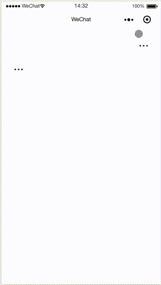

# @minidesign/popmenu



## Install

> - 从小程序基础库版本 2.2.1 或以上、及开发者工具 1.02.1808300 或以上开始，小程序支持使用 [npm](https://developers.weixin.qq.com/miniprogram/dev/devtools/npm.html) 安装第三方包
> - 如果你的不支持，那么可以先下载下来，在手动拷贝到你的`components/popmenu`文件夹下，在使用的细节上调整一下就行了。

1. `npm install --save @minidesign/popmenu`
2. 【微信开发者工具】->【工具】-> 【构建 npm】
3. ok. （别忘记执行【构建 npm】步骤）

## Usage

### [page].json

```json
{
  "usingComponents": {
    "popmenu": "@minidesign/popmenu"
  }
}
```

### [page].wxml

```html
<view class="item right">
  <popmenu
    menus="{{['喜欢', '评论']}}"
    bindselect="onSelect"
    default-width="{{113}}"
    payload="{{ {hello: true} }}"
  >
    <image class="image" src="./three-point.png"></image>
  </popmenu>
</view>
<view class="item left">
  <popmenu
    menus="{{['喜欢', '评论']}}"
    direction="right"
    default-width="{{113}}"
    bindselect="onSelect"
    payload="{{ {hello: true} }}"
  >
    <image class="image" src="./three-point.png"></image>
  </popmenu>
</view>
```

### [page].js

```javascript
Page({
  onSelect(e) {
    const { index, menu, payload } = e.detail;
    wx.showModal({
      title: `选择了第${index + 1}个菜单: ${menu}`,
      content: JSON.stringify(payload, null, 2)
    });
  }
});
```

## options

| Name            | Type           | Default | Description                                                          |
| --------------- | -------------- | ------- | -------------------------------------------------------------------- |
| menus           | String[]       | `[]`    | 菜单列表                                                             |
| direction       | String         | `left`  | 按钮方向，`left | right`                                             |
| bindselect      | Function       | null    | 选择菜单监听函数，`detail: { index, menu, payload }`                 |
| visible         | Boolean        | `false` | 手动控制是否显示                                                     |
| payload         | Object         | `{}`    | 荷载                                                                 |
| default-width   | Number         | `null`  | 设置菜单宽度，显示第一次点击时候的动画，不设置则从第二次开始拥有动画 |
| container-class | CSS Class Name | `''`    | 容器样式                                                             |
